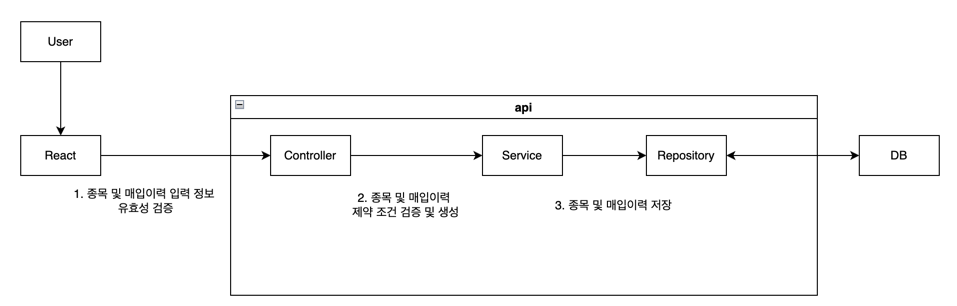
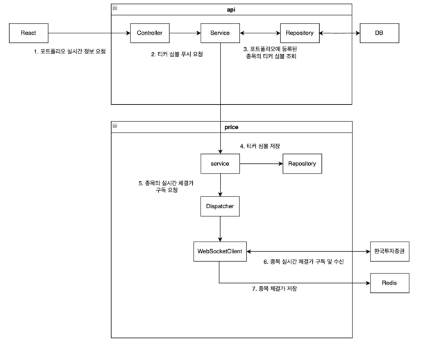

# :pushpin: FineAnts

> 주식 포트폴리오 가상 관리 및 알림 서비스  
> https://www.fineants.co/

## 1. 제작 기간 & 참여 인원

- 2023 10월 10일 ~ 진행중
- 팀 프로젝트
    - 백엔드
        - [네모네모](https://github.com/yonghwankim-dev)
        - [이예인](https://github.com/yein-lee)
        - [무비](https://github.com/yhpark95)
    - 프론트엔드
        - [박하](https://github.com/bakhacode)
        - [Jay](https://github.com/altmit)
        - [카카모토비](https://github.com/Kakamotobi)

## 2. 사용 기술

- Java 17
- Spring Boot 3.1
- Gradle
- Spring Data JPA
- QueryDSL
- Firebase-admin
- Spring AWS
- Test Container
- MySQL 8.0
- Redis

## 3. 아키텍처 구조


**fineants frontend**

- React 기반 웹 서버 애플리케이션

**fineants was**

- Spring 프레임워크 기반 웹 애플리케이션 서버
- 사용자의 포트폴리오를 관리하고 종목의 정보를 이용하여 포트폴리오의 손익율을 계산하여 응답
- 포트폴리오의 목표수익률 또는 최대손실율 달성 여부에 따라서 알림을 전송

**MySQL**

- 회원, 포트폴리오, 종목 등의 데이터를 저장

**Redis**

- 종목의 현재가, 종가 데이터를 저장
- 회원의 로그아웃 내역을 저장
- 한국투자증권의 액세스 토큰 저장

**한국투자증권**

- 오픈 API 서버로써 종목, 배당금 관련 정보를 조회

**Google/Kakao/Naver**

- OAuth 소셜 로그인을 위한 플랫폼
- 해당 플랫폼을 통해서 소셜 로그인을 수행

## 3. ERD 설계


## 4. 핵심 기능

<details>
<summary>포트폴리오 생성 및 관리 기능</summary>
<div markdown="1">

### 4.1 포트폴리오 생성


1. 클라이언트로부터 포트폴리오 생성 입력 정보를 받은 컨트롤러는 입력 정보의 유효성을 검증합니다.
2. 서비스는 포트폴리오의 입력 정보를 기반으로 생성할 수 있는지 제약조건*을 검증하고 생성합니다.
    - *사용자는 목록에 있는 증권사 목록 안에서만 선택
    - *회원별로 각 포트폴리의 이름은 고유해야 하지만,다른 회원들의 포트폴리오 이름과는 중복될 수 있습니다.
    - *포트폴리오의 목표수익금액은 예산보다 커야 하며, 최대손실금액은 예산보다 작아야 하는 제약조건을 만족해야 합니다.
3. 저장소는 서비스로부터 받은 포트폴리오를 데이터베이스에 저장합니다.

### 4.2 포트폴리오 종목 및 매입 이력 추가



1. 클라이언트로부터 포트폴리오 종목 및 매입 이력 입력 정보를 받은 컨트롤러는 유효성 검증을 수행합니다.
2. 서비스는 종목 및 매입 이력 입력 정보의 제약 조건*을 검증하고 인스턴스를 생성합니다.
    - ***포트폴리오의 잔고가 매입 이력을 추가하기에 충분한 금액이 있어야 합니다.**
    - *추가하고자 하는 종목이 데이터베이스 내에 존재해야 합니다.
3. 저장소는 서비스로부터 받은 포트폴리오 종목 및 매입 이력을 데이터베이스에 저장합니다.

### 4.3 포트폴리오 실시간 정보 조회

포트폴리오 실시간 정보 조회는 포트폴리오와 포트폴리오 종목 및 매입이력에 대한 계산 정보들을 실시간으로 조회하는 API입니다.
해당 API는 SSE(Server-Sent-Event) 방식으로 특정 시간 간격으로 데이터를 서버로부터 푸시받습니다.


1. 컨트롤러는 클라이언트로부터 포트폴리오 실시간 정보 조회를 요청받습니다. 컨트롤러는 서비스에 포트폴리오 등록번호를 전달하며 조회를 요청합니다.
2. 서비스는 SseEmitter를 생성하고 Observable 객체를 생성 후 구독을 수행합니다.
    1. 서비스는 SseEmitter를 생성하고 바로 클라이언트에게 반환합니다.
    2. PortfolioObservable 컴포넌트를 이용하여 Observable 객체를 생성합니다.
        - 생성한 Observable 객체는 5초 간격으로 총 30초 동안 데이터를 발행
    3. 생성한 Observable 객체 반환
    4. 반환받은 Observable 객체에 구독을 요청합니다. 해당 객체는 포트폴리오의 실시간 정보를 계산후 데이터를 발행합니다.
    5. Observable 객체는 다른 서비스를 통하여 포트폴리오 정보 조회 후 필요한 정보를 게산합니다.
    6. 데이터가 발행되면 Observer에게 전달되어 구독 처리를 수행합니다.
        - PortfolioObserver는 SseEmitter을 주입받는 상태
    7. Observer는 의존 주입된 SseEmitter 객체를 통하여 클라이언트에게 데이터(포트폴리오 실시간 정보)를 푸시합니다.

### 4.4 포트폴리오 계산 기능

포트폴리오의 정보와 포트폴리오에 등록된 종목 및 매입 이력을 기반으로 정보를 계산합니다. 예를 들어 다음 수행 과정은 포트폴리오의 총 투자 금액을 계산합니다.


1. 포트폴리오 계산기 객체에게 포트폴리오를 전달하며 총 투자 금액을 요청
2. 포트폴리오 객체에게 계신기 객체 자신을 전달하며 총 투자 금액 계산을 요청
3. 포트폴리오 객체는 계산기 객체의 포트폴리오 종목을 매개변수로 받는 총 투자 금액 메서드를 호출하며 포트폴리오 종목 리스트를 전달
4. 포트폴리오 종목 리스트를 받은 계산기 객체는 각 종목에 대하여 총 투자 금액 계산을 요청하고 합계로 누적
5. 포트폴리오 종목은 매개변수로 전달된 계산기 객체를 통하여 매입 이력 리스트를 전달하며 매입 이력의 총 투자 금액 메서드를 요청
6. 매입 이력 리스트를 전달받은 계산기 객체는 각 매입 이력의 총 투자 금액의 합계를 계산
7. 매입이력은 총 투자금액을 계산하고 반환
    - 매입 이력의 총 투자금액 = 매입 평균가 * 주식 개수
8. 매입 이력들의 총 투자금액 합계를 계산하여 반환

</div>
</details>

<details>
<summary>실시간 종목 관리 기능</summary>
<div markdown="1">

### 4.5 종목 현재가 업데이트 기능



1. 회원은 포트폴리오 실시간 정보 조회를 요청합니다.
2. 컨트롤러는 서비스에게 포트폴리오 등록 번호를 전달하며 포트폴리오에 등록된 종목 티커 심볼 푸시를 요청합니다.
3. 서비스는 장 시간 중이라면 저장소에 요청하여 포트폴리오에 등록된 종목들의 티커 심볼들을 조회합니다.
4. 서비스는 티커 심볼들을 메모리 저장소에 저장합니다.
5. 서비스는 각 티커 심볼이 구독 가능*하면 디스패처를 통해서 종목 실시간 체결가 구독하기 위한 웹소켓 연결을 수행합니다.
    - 종목 실시간 체결가가 구독 불가능하다면 REST API 방식으로 현재가를 조회한 다음 레디스에 저장합니다.
    - *구독시 종목 체결가가 발생 및 수신할 때마다 체결가를 레디스 저장소에 저장합니다.
    - *최대 구독 가능 개수는 20개
6. 웹소켓 클라이언트는 티커 심볼을 이용하여 한국투자증권과 종목 실시간 체결가를 구독하고 실시간으로 종목 체결가를 받습니다.
7. 종목 체결가를 받으면 레디스에 체결가를 저장합니다.

</div>
</details>

<details>
<summary>알림 기능</summary>
<div markdown="1">

### 4.6 포트폴리오 목표수익금액 알림 기능

포트폴리오 목표수익금액 알림 기능은 **포트폴리오의 총 평가 금액이 목표수익금액에 도달하면 사용자에게 FCM 알림을 전송하는 기능**입니다.


1. 종목의 실시간 현재가가 변경되면 현재가 변경 이벤트가 발생
2. 이벤트 리스너는 종목 현재가 이벤트를 수신한 다음에 이벤트를 처리
3. 알림 서비스(NotificationService)는 포트폴리오의 목표수익금액 알림 서비스를 처리
4. 알림 서비스는 포트폴리오 리스트를 조회하고 디스패처(Dispatcher)에게 알림 처리를 요청
5. 디스패처는 알림 조건*에 맞는 포트폴리오를 대상으로 알림을 전송
    - *포트폴리오의 총 평가금액이 목표수익금액 이상인 경우
    - *포트폴리오에 설정된 목표수익금액 알림 활성화된 경우
    - *계정의 목표수익금액 알림 활성화된 경우
    - *전송 내역이 없는 경우
    - 알림 전송의 성공 여부와 관계없이 알림 메시지는 데이터베이스에 저장됨
6. 조건에 맞는 포트폴리오들을 받은 서비스(FcmService)는 FCM 알림을 전송
7. 외부의 FCM 서버는 FCM 토큰을 이용하여 리액트 클라이언트와 사용자의 디바이스(노트북, 테블릿 등)에 알림을 전송
8. 알림에 성공한 포트폴리오들을 대상으로 전송 내역을 레디스에 저장합니다.
    - 알림 전송 내역은 24시간 동안 저장됨

</div>
</details>

## 5. 핵심 트러블 슈팅

<details>
<summary>스프링 문제</summary>
<div markdown="1">

<details>
<summary>매입 이력 추가 후 알림 이벤트에서 매입 이력 리스트 지연 로딩 문제</summary>
<div markdown="1">

### 해결 시도 1

- 매입 이력 추가 서비스 과정에서 지연 로딩된 연관 엔티티(매입 이력 엔티티, PurchaseHistory) 리스트를 이미 로딩되었기 때문에
  이벤트 수행 과정에서 직전에 추가된 매입이력이 조회되지 않은 것이 원인
- 매입 이력 추가 서비스에서 직전에 추가된 매입 이력을 연관 엔티티 리스트에 추가하도록 하여 문제 해결(영속성 전이는 설정하지 않고 별도로 db에 추가하도록 하는 방식으로 수행)

- [issue#275](https://github.com/fine-ants/FineAnts-was/issues/275)

### 해결 시도 2

- 이벤트 리스너에서 @Async 애노테이션을 통하여 이벤트가 비동기로 동작한다고 생각하였으나 @EnableAsync 애노테이션을 설정하지 않아서
  동기적으로 수행된 것이 원인.
- 매입 이력 추가 서비스와 목표수익금액 달성 알림 이벤트가 같은 트랜잭션 내에 있기 때문에 직전에 추가된 매입이력이 조회되지 않는 것이 원인
- 설정 클래스에 @EnableAysnc 애노테이션을 추가하여 비동기적으로 수행하게 하고, @TransactionalEventListener 애노테이션을 이벤트 리스너 메서드에 적용하여 매입 이력 추가 서비스 후에
  동작하도록 개선
- [issue#515](https://github.com/fine-ants/FineAnts-was/issues/515)

</div>
</details>

</div>
</details>

<details>
<summary>데이터베이스 문제</summary>
<div markdown="1">

<details>
<summary>FCM 토큰 등록 오류</summary>
<div markdown="1">

- 배포 db 서버의 FcmToken 테이블의 PK 컬럼에 auto_increment가 적용되지 않은 것이 원인
- fcm_token 테이블을 삭제하고 다시 생성할때 PK 컬럼에 auto_increment 설정하여 문제 해결

- [issue#208](https://github.com/fine-ants/FineAnts-was/issues/208)

</div>
</details>

</div>
</details>


<details>
<summary>권한 문제</summary>
<div markdown="1">

<details>
<summary>회원 알림 API 권한 문제</summary>
<div markdown="1">

- 배경: 본인이 아닌 다른 사용자의 알림 API(예: 알림 목록 조회)를 호출하는 것이 문제
- 원인: API 경로중 경로 변수 중에서 회원의 등록번호(memberId)가 존재하는데 서비스 수행시 회원 본인의 것인지 검증하지 않은 것이 원인
- 문제 해결: 해당 서비스에 AOP를 적용하여 알림을 전송할 권한이 있는지 검증하도록 하여 문제 해결

```java

@Slf4j
@RequiredArgsConstructor
@Aspect
@Component
public class HasNotificationAuthorizationAspect {

	private final AuthenticationContext authenticationContext;

	@Before(value = "within(@org.springframework.web.bind.annotation.RestController *) && @annotation(hasNotificationAuthorization) && args(memberId, ..)", argNames = "hasNotificationAuthorization,memberId")
	public void hasAuthorization(final HasNotificationAuthorization hasNotificationAuthorization,
		@PathVariable final Long memberId) {
		AuthMember authMember = authenticationContext.getAuthMember();
		log.info("알림 권한 확인 시작, memberId={}, authMember : {}", memberId, authMember);
		if (!memberId.equals(authMember.getMemberId())) {
			throw new ForBiddenException(MemberErrorCode.FORBIDDEN_MEMBER);
		}
	}
} 
```

- [issue#203](https://github.com/fine-ants/FineAnts-was/issues/203)

</div>
</details>

</div>
</details>

<details>
<summary>Server-Sent-Event(SSE) 문제</summary>
<div markdown="1">

<details>
<summary>Hikari Connection Pool 고갈 문제</summary>
<div markdown="1">

- 배경: 데이터베이스 연결이 불가능하여 SSE 푸시할 수 없음
- 원인: SSE 연결로 인하여 HTTP가 연결을 유지하는 동안 서비스 레이어의 트랜잭션이 종료되었음에도 불구하고 OSIV(Open Session In View)가 활성화되어 있어
  30초 동안 Hikari Connection Pool의 연결 쓰레드를 점유한 것이 원인
- 해결 방법: OSIV 비활성화하여 문제 해결

- [issue#123](https://github.com/fine-ants/FineAnts-was/issues/123)

</div>
</details>

<details>
<summary>포트폴리오 상세 조회 SSE 데이터 응답 문제</summary>
<div markdown="1">

- 배경: 배포환경에서 포트폴리오 상세 조회 SSE API 호출시 계속 블로킹되다가 타임아웃 되어버림
- 원인: SSE 데이터 응답 생성을 별도의 쓰레드에서 수행하던 과정 중에서 종목의 종가가 존재하지 않아서 예외가 발생했을때 별도의 예외 처리를 하지 않은 것이 원인
- 해결 방법: Exception 타입으로 캐치하도록 변경하여 모든 예외를 대상으로 캐치하여 SseEmitter 객체를 대상으로 completeWithError 호출하여 해결

- [issue#57](https://github.com/fine-ants/FineAnts-was/issues/57)

</div>
</details>

</div>
</details>

<details>
<summary>액세스 토큰 문제</summary>
<div markdown="1">

<details>
<summary>한국투자증권의 액세스 토큰 만료시 발급 문제</summary>
<div markdown="1">

### 해결 시도 1

- 배경: 한국투자증권의 액세스 토큰 만료시 재발급을 요청하지만, 실패하는 경우 그대로 끝남
- 원인: 액세스 토큰 발급이 실패하는 경우 다시 시도하지 않는 것이 원인
- 해결 방법: retryWhen Operator를 이용하여 다시 시도하도록 하여 문제 해결

### 해결 시도 2

- 배경: 액세스 토큰을 재발급은 하지만 레디스 저장소에 저장되지 않음
- 원인: Webflux의 subscribe를 통하여 레디스에 저장해야 하지만, 비동기로 동작하기 때문에 대기하지 않고 종료되는 것이 원인
- 해결 방법: CountDownLatch 객체를 사용하여 액세스 토큰 재발급 처리가 완료될때까지 대기하여 문제 해결

- [issue#131](https://github.com/fine-ants/FineAnts-was/issues/131)

</div>
</details>

<details>
<summary>Redis 액세스 토큰 만료시간 문제</summary>
<div markdown="1">

- 배경: 액세스 토큰이 실제로 만료되었음에도 불구하고 레디스에 남아있음
- 원인: 한국투자증권 서버로부터 발급받은 액세스 토큰은 실제 만료시간은 22시간동안 유지되지만 `expires_in` 프로퍼티는 24시간을 가리키고 있음. 액세스 토큰 발급 만료시간 계산시 `expires_in`
  프로퍼티를 기준으로 계산한 것이 원인
- 해결 방법: `access_token_token_expired` 프로퍼티를 기준으로 액세스 토큰 만료시간을 설정하도록 변경하여 문제 해결

- [issue#63](https://github.com/fine-ants/FineAnts-was/issues/63)

</div>
</details>

<details>
<summary>종가 갱신 스케줄링 메소드 실행전 액세스 토큰 발급 문제</summary>
<div markdown="1">

- 배경: 종가 갱신전에 액세스 토큰이 만료되어 갱신되지 않음
- 원인: 한국투자증권 API 서버의 액세스 토큰이 만료되었는지 체크하는 AOP에서 종가 갱신 스케줄링 메서드를 추가하지 않은 것이 원인
- 해결 방법: 종가 갱신 스케줄링 메서드를 AOP에 추가하여 문제 해결

- [issue#120](https://github.com/fine-ants/FineAnts-was/issues/120)

</div>
</details>


</div>
</details>

## 6. 그 외 트러블 슈팅

<details>
<summary>redis 컨테이너 실행시 rdb 파일을 생성하지 않도록 설정</summary>
<div markdown="1">

- Redis의 스냅샷 작성시 실패하게 되면 Write 명령어를 전부 거부함에 따라 rdb(redis database) 파일을 생성하지 않도록 설정

```
stop-writes-on-bgsave-error no
save ""
```

- [issue#38](https://github.com/fine-ants/FineAnts-was/issues/38)

</div>
</details>

<details>
<summary>종목 지정가 도달 알림 문제 해결</summary>
<div markdown="1">

- 종목 지정가 알림 전송 이력 전송시 알림마다 생성되는 등록번호(PK, Notification.id)를 키값으로 저장하는 것이 아닌
  종목 지정가 데이터에 대한 등록번호(PK, TargetPriceNotification.id)를 기준으로 저장합니다.

```
// 발송 이력 저장
.map(future -> future.thenCompose(item -> {
	sentManager.addTargetPriceNotification(item.getTargetPriceNotificationId());
	return CompletableFuture.supplyAsync(() -> item);
}))
```

- [issue#268](https://github.com/fine-ants/FineAnts-was/issues/268)

</div>
</details>

<details>
<summary>프로필 변경 문제</summary>
<div markdown="1">

- 프로필 정보에서 프로필 이미지만 변경하는 경우에 텍스트 정보가 필수값으로 설정되어 있어서 옵션을 선택적으로 변경

```
public ApiResponse<ProfileChangeResponse> changeProfile(
		@RequestPart(value = "profileImageFile", required = false) MultipartFile profileImageFile,
		@Valid @RequestPart(value = "profileInformation", required = false) ProfileChangeRequest request,
		@AuthPrincipalMember AuthMember authMember)
```

- [issue#164](https://github.com/fine-ants/FineAnts-was/issues/164)

</div>
</details>

<details>
<summary>비밀번호 변경 문제</summary>
<div markdown="1">

- 비밀번호 변경 서비스 메서드에서 `@Transactional(readOnly=true)`를 `@Transactional`로 변경하여 해결

```
@Transactional
public void modifyPassword(ModifyPasswordRequest request, AuthMember authMember) {
```

- [issue#162](https://github.com/fine-ants/FineAnts-was/issues/162)

</div>
</details>

<details>
<summary>회원가입 서비스 문제</summary>
<div markdown="1">

- 회원가입시 프로필 사진과 json 형식의 회원가입 정보를 같이 전달하는 경우 json 데이터가 전달되지 않는 문제
- 클라이언트인 React에서 로컬 개발시 목서버를 끔으로써 문제를 해결
- [issue#159](https://github.com/fine-ants/FineAnts-was/issues/159)

</div>
</details>

<details>
<summary>회원 닉네임 랜덤 생성 길이 10자로 제한</summary>
<div markdown="1">

- member.nickname.len 프로퍼티의 길이를 7로 설정하여 문제를 해결
- 랜덤 닉네임 형식 : 일개미(3자) + 랜덤 문자열 7자

```yml
member:
  nickname:
    prefix: 일개미
    len: 7
```

- [issue#154](https://github.com/fine-ants/FineAnts-was/issues/154)

</div>
</details>

<details>
<summary>일반 로그인 오타 수정</summary>
<div markdown="1">

- 로컬 회원을 db에서 조회시 provider(플랫폼) 매개변수에 null이 아닌 "local"을 전달하여 문제를 해결

```
@Transactional(readOnly = true)
public LoginResponse login(LoginRequest request) {
  Member member = memberRepository.findMemberByEmailAndProvider(request.getEmail(), LOCAL_PROVIDER)
  .orElseThrow(() -> new BadRequestException(MemberErrorCode.LOGIN_FAIL));
  // ...
  return LoginResponse.from(jwt, OauthMemberResponse.from(member));
}
```

- [issue#133](https://github.com/fine-ants/FineAnts-was/issues/133)

</div>
</details>

<details>
<summary>라인 차트 조회시 데이터 정렬</summary>
<div markdown="1">

- 포트폴리오들의 전체 평가금액에 대한 라인 차트 조회시 일자를 기준으로 오름차순으로 정렬하여 문제를 해결

```
return timeValueMap.keySet()
		.stream()
		.sorted()
		.map(key -> DashboardLineChartResponse.of(key, timeValueMap.get(key)))
		.collect(Collectors.toList());
```

- [issue#84](https://github.com/fine-ants/FineAnts-was/issues/84)

</div>
</details>

<details>
<summary>포트폴리오 단일 삭제 문제</summary>
<div markdown="1">

- 포트폴리오 단일 삭제시 일대다 관계를 맺고 있는 포트폴리오의 수익 내역 데이터(PortfolioGainHistory)들을 먼저 제거하여 단일 삭제 문제를 해결

```
int delPortfolioGainHistoryCnt = portfolioGainHistoryRepository.deleteAllByPortfolioId(portfolioId);
log.info("포트폴리오 손익 내역 삭제 개수 : {}", delPortfolioGainHistoryCnt);
```

- [issue#83](https://github.com/fine-ants/FineAnts-was/issues/83)

</div>
</details>

<details>
<summary>AuthMember 문제</summary>
<div markdown="1">

- AuthMember 타입에 대한 매개변수 리졸버를 설정 클래스 파일에 추가함으로써 문제를 해결

```java

@Configuration
@RequiredArgsConstructor
public class WebConfig implements WebMvcConfigurer {
	private final AuthPrincipalArgumentResolver authPrincipalArgumentResolver;

	@Override
	public void addArgumentResolvers(List<HandlerMethodArgumentResolver> resolvers) {
		resolvers.add(authPrincipalArgumentResolver);
	}
}
```

- [issue#31](https://github.com/fine-ants/FineAnts-was/issues/31)

</div>
</details>

<details>
<summary>로그아웃 문제</summary>
<div markdown="1">

- 로그아웃이 정상적으로 수행하기 위해서 로그아웃 인터셉터를 설정 클래스 파일에 추가하여 문제를 해결

```java

@Slf4j
public class LogoutInterceptor implements HandlerInterceptor {
	@Override
	public boolean preHandle(HttpServletRequest request, HttpServletResponse response, Object handler) throws
		Exception {
		log.debug("로그아웃 인터셉터 접속 : {}", request.getRequestURI());
		String accessToken = extractJwt(request).orElseThrow(
			() -> new UnAuthorizationException(JwtErrorCode.EMPTY_TOKEN));
		request.setAttribute("accessToken", accessToken);
		return true;
	}

	private Optional<String> extractJwt(HttpServletRequest request) {
		String header = request.getHeader(AUTHORIZATION);

		if (!StringUtils.hasText(header) || !header.startsWith(BEARER)) {
			return Optional.empty();
		}

		return Optional.of(header.split(" ")[1]);
	}
}
```

- [issue#29](https://github.com/fine-ants/FineAnts-was/issues/29)

</div>
</details>

<details>
<summary>sse 전송 시간 문제</summary>
<div markdown="1">

- 다수의 클라이언트가 동일한 포트폴리오 번호를 이용하여 실시간 포트폴리오 상세 정보(sse 방식) 요청시 한 클라이언트를 제외한 다른 클라이언트의 연결이 끊어지는 문제
- sseEmitter 객체의 관리를 해시맵으로 관리하고 있었고 해시맵의 키값을 포트폴리오 번호로 관리하였기 때문에 발생한 문제
- sseEmitter 관리하는 해시맵의 키값을 이벤트 ID와 포트폴리오 등록번호를 가진 SseEmitterKey 타입으로 변경하여 문제를 해결

```java

@Getter
@ToString
@EqualsAndHashCode(of = "eventId")
@RequiredArgsConstructor
public class SseEmitterKey {
	private final Long eventId;
	private final Long portfolioId;

	public static SseEmitterKey create(Long portfolioId) {
		return new SseEmitterKey(
			System.currentTimeMillis(),
			portfolioId
		);
	}
}
```

- [issue#140](https://github.com/fine-ants/FineAnts-was/pull/140)

</div>
</details>

## 7. 회고 / 느낀점

> 프로젝트 개발 회고 글: https://yonghwankim-dev.tistory.com/599
