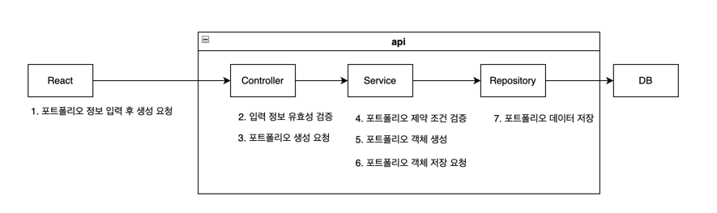

# :pushpin: FineAnts

> 주식 포트폴리오 가상 관리 및 알림 서비스  
> https://www.fineants.co/

## 1. 제작 기간 & 참여 인원

- 2023 10월 10일 ~ 진행중
- 팀 프로젝트
    - 백엔드
        - [네모네모](https://github.com/yonghwankim-dev)
        - [이예인](https://github.com/yein-lee)
        - [무비](https://github.com/yhpark95)
    - 프론트엔드
        - [박하](https://github.com/bakhacode)
        - [Jay](https://github.com/altmit)
        - [카카모토비](https://github.com/Kakamotobi)

## 2. 사용 기술

- Java 17
- Spring Boot 3.1
- Gradle
- Spring Data JPA
- QueryDSL
- Firebase-admin
- Spring AWS
- Test Container
- MySQL 8.0
- Redis

## 3. 아키텍처 구조


**fineants frontend**

- React 기반 웹 서버 애플리케이션

**fineants was**

- Spring 프레임워크 기반 웹 애플리케이션 서버
- 사용자의 포트폴리오를 관리하고 종목의 정보를 이용하여 포트폴리오의 손익율을 계산하여 응답
- 포트폴리오의 목표수익률 또는 최대손실율 달성 여부에 따라서 알림을 전송

**MySQL**

- 회원, 포트폴리오, 종목 등의 데이터를 저장

**Redis**

- 종목의 현재가, 종가 데이터를 저장
- 회원의 로그아웃 내역을 저장
- 한국투자증권의 액세스 토큰 저장

**한국투자증권**

- 오픈 API 서버로써 종목, 배당금 관련 정보를 조회

**Google/Kakao/Naver**

- OAuth 소셜 로그인을 위한 플랫폼
- 해당 플랫폼을 통해서 소셜 로그인을 수행

## 3. ERD 설계


## 4. 핵심 기능

<details>
<summary>포트폴리오 생성 및 관리 기능</summary>
<div markdown="1">

### 4.1 포트폴리오 생성



1. 회원은 포트폴리오 생성시 필요한 정보를 입력하고 생성을 요청합니다.
2. 서버는 제출한 포트폴리오의 입력 정보의 유효성 및 제약 조건을 검증합니다.
    - 사용자는 목록에 있는 증권사 목록 안에서만 선택
    - 회원별로 각 포트폴리의 이름은 고유해야 하지만,다른 회원들의 포트폴리오 이름과는 중복될 수 있습니다.
    - 포트폴리오의 목표수익금액은 예산보다 커야 하며, 최대손실금액은 예산보다 작아야 하는 제약조건을 만족해야 합니다.
3. 유효성 및 제약 조건을 만족하면 포트폴리오를 생성합니다.
4. 생성한 포트폴리오를 데이터베이스에 저장합니다.

</div>
</details>

## 5. 핵심 트러블 슈팅

<details>
<summary>매입 이력 추가 후 목표수익률 이벤트 지연 로딩 문제</summary>
<div markdown="1">

- 매입 이력 추가 서비스 과정에서 지연 로딩된 연관 엔티티를 이미 로딩되었기 때문에 이벤트 수행 과정에서 직전에 추가된 매입이력이 조회되지 않은 것이 원인
- 매입 이력 추가 서비스에서 직전에 추가된 매입 이력을 연관 엔티티 리스트에 추가하도록 하여 문제 해결(영속성 전이는 설정하지 않고 별도로 db에 추가하도록 하는 방식으로 수행)

- [issue#275](https://github.com/fine-ants/FineAnts-was/issues/275)

</div>
</details>

<details>
<summary>FCM 토큰 등록 오류</summary>
<div markdown="1">

- 배포 db 서버의 FcmToken 테이블의 PK 컬럼에 auto_increment가 적용되지 않은 것이 원인
- PK 컬럼에 auto_increment 적용하여 문제 해

- [issue#208](https://github.com/fine-ants/FineAnts-was/issues/208)

</div>
</details>

<details>
<summary>회원 알림 관련 API 권한 문제</summary>
<div markdown="1">

- API 경로중 경로 변수 중에서 회원의 등록번호(memberId)가 존재하는데 서비스 수행시 회원 본인의 것인지 검증하지 않은 것이 원인
- 해당 서비스에 AOP를 적용하여 알림을 전송할 권한이 있는지 검증하도록 하여 문제 해결

```java

@Slf4j
@RequiredArgsConstructor
@Aspect
@Component
public class HasNotificationAuthorizationAspect {

	private final AuthenticationContext authenticationContext;

	@Before(value = "within(@org.springframework.web.bind.annotation.RestController *) && @annotation(hasNotificationAuthorization) && args(memberId, ..)", argNames = "hasNotificationAuthorization,memberId")
	public void hasAuthorization(final HasNotificationAuthorization hasNotificationAuthorization,
		@PathVariable final Long memberId) {
		AuthMember authMember = authenticationContext.getAuthMember();
		log.info("알림 권한 확인 시작, memberId={}, authMember : {}", memberId, authMember);
		if (!memberId.equals(authMember.getMemberId())) {
			throw new ForBiddenException(MemberErrorCode.FORBIDDEN_MEMBER);
		}
	}
} 
```

- [issue#203](https://github.com/fine-ants/FineAnts-was/issues/203)

</div>
</details>

<details>
<summary>한국투자증권 액세스 토큰 만료시 발급 문제</summary>
<div markdown="1">

- 액세스 토큰 재발급시 재발급 처리가 종료되기전까지 메서드가 대기하지 않고 종료된 것이 원인
- CountDownLatch 객체를 사용하여 액세스 토큰 재발급 처리가 완료될때까지 대기하여 문제 해결

- [issue#131](https://github.com/fine-ants/FineAnts-was/issues/131)

</div>
</details>

<details>
<summary>redis accessTokenMap 만료시간 문제</summary>
<div markdown="1">

- 한국투자증권 서버로부터 발급받은 액세스 토큰은 실제 만료시간은 22시간동안 유지되지만 `expires_in` 프로퍼티는 24시간을 가리키고 있음. 액세스 토큰 발급 만료시간 계산시 `expires_in`
  프로퍼티를 기준으로 계산한 것이 원인.
- `access_token_token_expired` 프로퍼티를 기준으로 액세스 토큰 만료시간을 설정하도록 변경하여 문제 해결

- [issue#63](https://github.com/fine-ants/FineAnts-was/issues/63)

</div>
</details>

<details>
<summary>종목 종가 갱신 문제</summary>
<div markdown="1">

- 액세스 토큰 만료시간을 `expires_in`을 기준으로 하는 것이 아닌 `access_token_token_expired` 프로퍼티를 기준으로 설정하도록 하여 문제 해결
- CompletableFuture 객체의 잘못된 순서의 타임아웃 콜백 설정 및 예외 처리 설정으로 인한 무한대기가 원인입니다. CompletableFuture 객체 생성시 바로 다음에 타임아웃 콜백 및 예외 처리
  설정하여 문제를 해결

- [issue#90](https://github.com/fine-ants/FineAnts-was/issues/90)

</div>
</details>

<details>
<summary>서버 시작시 KIS 액세스 토큰 발급 실패 문제</summary>
<div markdown="1">

- 서버 시작시 종목 및 종가 갱신하기 전 한국투자증권 서버의 액세스 토큰을 발급받습니다. 그러나 요청 횟수 초과와 같은 사유로 발급 실패시
  별도의 조치없이 초기화가 끝나는 것이 원인
- 액세스 토큰 발급 실패시 `retryWhen` operator를 이용하여 특정 시간 간격으로 다시 시도하여 발급받을 수 있도록 하여 문제 해결

- [issue#110](https://github.com/fine-ants/FineAnts-was/issues/110)

</div>
</details>

<details>
<summary>종가 갱신 스케줄링 메소드 실행전 액세스 토큰 발급 문제</summary>
<div markdown="1">

- 한국투자증권 API 서버의 액세스 토큰이 만료되었는지 체크하는 AOP에서 종가 갱신 스케줄링 메서드를 추가하지 않은 것이 원인
- 종가 갱신 스케줄링 메서드를 AOP에 추가하여 문제 해결

- [issue#120](https://github.com/fine-ants/FineAnts-was/issues/120)

</div>
</details>

<details>
<summary>Hikari Connection Pool 고갈 문제</summary>
<div markdown="1">

- SSE 연결로 인하여 HTTP가 연결을 유지하는 동안 서비스 레이어의 트랜잭션이 종료되었음에도 불구하고 OSIV(Open Session In View)가 활성화되어 있어
  30초 동안 Hikari Connection Pool의 연결 쓰레드를 점유한 것이 원인
- OSIV 비활성화하여 문제 해결

- [issue#123](https://github.com/fine-ants/FineAnts-was/issues/123)

</div>
</details>

<details>
<summary>포트폴리오 상세 조회 SSE 데이터 응답 문제</summary>
<div markdown="1">

- SSE 데이터 응답 생성을 별도의 쓰레드에서 수행하던 과정 중에서 종목의 종가가 존재하지 않아서 예외가 발생했을때 별도의 예외 처리를 하지 않은 것이 원인
- Exception 타입으로 캐치하도록 변경하여 모든 예외를 대상으로 캐치하여 SseEmitter 객체를 대상으로 completeWithError 호출하여 해결

- [issue#57](https://github.com/fine-ants/FineAnts-was/issues/57)

</div>
</details>

<details>
<summary>종목 최신화시 데이터가 db에 반영되지 않는 문제</summary>
<div markdown="1">

- 이전 tsv 파일 기반 종목 최신화 스케줄링 메서드가 실행되어 예상과 다른 실행이 원인
- 이전에 구현한 종목 최신화 스케줄링 메서드 제거하여 해결

- [issue#287](https://github.com/fine-ants/FineAnts-was/issues/287)

</div>
</details>

## 6. 그 외 트러블 슈팅

<details>
<summary>redis 컨테이너 실행시 rdb 파일을 생성하지 않도록 설정</summary>
<div markdown="1">

- Redis의 스냅샷 작성시 실패하게 되면 Write 명령어를 전부 거부함에 따라 rdb(redis database) 파일을 생성하지 않도록 설정

```
stop-writes-on-bgsave-error no
save ""
```

- [issue#38](https://github.com/fine-ants/FineAnts-was/issues/38)

</div>
</details>

<details>
<summary>종목 지정가 도달 알림 문제 해결</summary>
<div markdown="1">

- 종목 지정가 알림 전송 이력 전송시 알림마다 생성되는 등록번호(PK, Notification.id)를 키값으로 저장하는 것이 아닌
  종목 지정가 데이터에 대한 등록번호(PK, TargetPriceNotification.id)를 기준으로 저장합니다.

```
// 발송 이력 저장
.map(future -> future.thenCompose(item -> {
	sentManager.addTargetPriceNotification(item.getTargetPriceNotificationId());
	return CompletableFuture.supplyAsync(() -> item);
}))
```

- [issue#268](https://github.com/fine-ants/FineAnts-was/issues/268)

</div>
</details>

<details>
<summary>프로필 변경 문제</summary>
<div markdown="1">

- 프로필 정보에서 프로필 이미지만 변경하는 경우에 텍스트 정보가 필수값으로 설정되어 있어서 옵션을 선택적으로 변경

```
public ApiResponse<ProfileChangeResponse> changeProfile(
		@RequestPart(value = "profileImageFile", required = false) MultipartFile profileImageFile,
		@Valid @RequestPart(value = "profileInformation", required = false) ProfileChangeRequest request,
		@AuthPrincipalMember AuthMember authMember)
```

- [issue#164](https://github.com/fine-ants/FineAnts-was/issues/164)

</div>
</details>

<details>
<summary>비밀번호 변경 문제</summary>
<div markdown="1">

- 비밀번호 변경 서비스 메서드에서 `@Transactional(readOnly=true)`를 `@Transactional`로 변경하여 해결

```
@Transactional
public void modifyPassword(ModifyPasswordRequest request, AuthMember authMember) {
```

- [issue#162](https://github.com/fine-ants/FineAnts-was/issues/162)

</div>
</details>

<details>
<summary>회원가입 서비스 문제</summary>
<div markdown="1">

- 회원가입시 프로필 사진과 json 형식의 회원가입 정보를 같이 전달하는 경우 json 데이터가 전달되지 않는 문제
- 클라이언트인 React에서 로컬 개발시 목서버를 끔으로써 문제를 해결
- [issue#159](https://github.com/fine-ants/FineAnts-was/issues/159)

</div>
</details>

<details>
<summary>회원 닉네임 랜덤 생성 길이 10자로 제한</summary>
<div markdown="1">

- member.nickname.len 프로퍼티의 길이를 7로 설정하여 문제를 해결
- 랜덤 닉네임 형식 : 일개미(3자) + 랜덤 문자열 7자

```yml
member:
  nickname:
    prefix: 일개미
    len: 7
```

- [issue#154](https://github.com/fine-ants/FineAnts-was/issues/154)

</div>
</details>

<details>
<summary>일반 로그인 오타 수정</summary>
<div markdown="1">

- 로컬 회원을 db에서 조회시 provider(플랫폼) 매개변수에 null이 아닌 "local"을 전달하여 문제를 해결

```
@Transactional(readOnly = true)
public LoginResponse login(LoginRequest request) {
  Member member = memberRepository.findMemberByEmailAndProvider(request.getEmail(), LOCAL_PROVIDER)
  .orElseThrow(() -> new BadRequestException(MemberErrorCode.LOGIN_FAIL));
  // ...
  return LoginResponse.from(jwt, OauthMemberResponse.from(member));
}
```

- [issue#133](https://github.com/fine-ants/FineAnts-was/issues/133)

</div>
</details>

<details>
<summary>라인 차트 조회시 데이터 정렬</summary>
<div markdown="1">

- 포트폴리오들의 전체 평가금액에 대한 라인 차트 조회시 일자를 기준으로 오름차순으로 정렬하여 문제를 해결

```
return timeValueMap.keySet()
		.stream()
		.sorted()
		.map(key -> DashboardLineChartResponse.of(key, timeValueMap.get(key)))
		.collect(Collectors.toList());
```

- [issue#84](https://github.com/fine-ants/FineAnts-was/issues/84)

</div>
</details>

<details>
<summary>포트폴리오 단일 삭제 문제</summary>
<div markdown="1">

- 포트폴리오 단일 삭제시 일대다 관계를 맺고 있는 포트폴리오의 수익 내역 데이터(PortfolioGainHistory)들을 먼저 제거하여 단일 삭제 문제를 해결

```
int delPortfolioGainHistoryCnt = portfolioGainHistoryRepository.deleteAllByPortfolioId(portfolioId);
log.info("포트폴리오 손익 내역 삭제 개수 : {}", delPortfolioGainHistoryCnt);
```

- [issue#83](https://github.com/fine-ants/FineAnts-was/issues/83)

</div>
</details>

<details>
<summary>AuthMember 문제</summary>
<div markdown="1">

- AuthMember 타입에 대한 매개변수 리졸버를 설정 클래스 파일에 추가함으로써 문제를 해결

```java

@Configuration
@RequiredArgsConstructor
public class WebConfig implements WebMvcConfigurer {
	private final AuthPrincipalArgumentResolver authPrincipalArgumentResolver;

	@Override
	public void addArgumentResolvers(List<HandlerMethodArgumentResolver> resolvers) {
		resolvers.add(authPrincipalArgumentResolver);
	}
}
```

- [issue#31](https://github.com/fine-ants/FineAnts-was/issues/31)

</div>
</details>

<details>
<summary>로그아웃 문제</summary>
<div markdown="1">

- 로그아웃이 정상적으로 수행하기 위해서 로그아웃 인터셉터를 설정 클래스 파일에 추가하여 문제를 해결

```java

@Slf4j
public class LogoutInterceptor implements HandlerInterceptor {
	@Override
	public boolean preHandle(HttpServletRequest request, HttpServletResponse response, Object handler) throws
		Exception {
		log.debug("로그아웃 인터셉터 접속 : {}", request.getRequestURI());
		String accessToken = extractJwt(request).orElseThrow(
			() -> new UnAuthorizationException(JwtErrorCode.EMPTY_TOKEN));
		request.setAttribute("accessToken", accessToken);
		return true;
	}

	private Optional<String> extractJwt(HttpServletRequest request) {
		String header = request.getHeader(AUTHORIZATION);

		if (!StringUtils.hasText(header) || !header.startsWith(BEARER)) {
			return Optional.empty();
		}

		return Optional.of(header.split(" ")[1]);
	}
}
```

- [issue#29](https://github.com/fine-ants/FineAnts-was/issues/29)

</div>
</details>

<details>
<summary>sse 전송 시간 문제</summary>
<div markdown="1">

- 다수의 클라이언트가 동일한 포트폴리오 번호를 이용하여 실시간 포트폴리오 상세 정보(sse 방식) 요청시 한 클라이언트를 제외한 다른 클라이언트의 연결이 끊어지는 문제
- sseEmitter 객체의 관리를 해시맵으로 관리하고 있었고 해시맵의 키값을 포트폴리오 번호로 관리하였기 때문에 발생한 문제
- sseEmitter 관리하는 해시맵의 키값을 이벤트 ID와 포트폴리오 등록번호를 가진 SseEmitterKey 타입으로 변경하여 문제를 해결

```java

@Getter
@ToString
@EqualsAndHashCode(of = "eventId")
@RequiredArgsConstructor
public class SseEmitterKey {
	private final Long eventId;
	private final Long portfolioId;

	public static SseEmitterKey create(Long portfolioId) {
		return new SseEmitterKey(
			System.currentTimeMillis(),
			portfolioId
		);
	}
}
```

- [issue#140](https://github.com/fine-ants/FineAnts-was/pull/140)

</div>
</details>

## 7. 회고 / 느낀점

> 프로젝트 개발 회고 글: https://yonghwankim-dev.tistory.com/599
